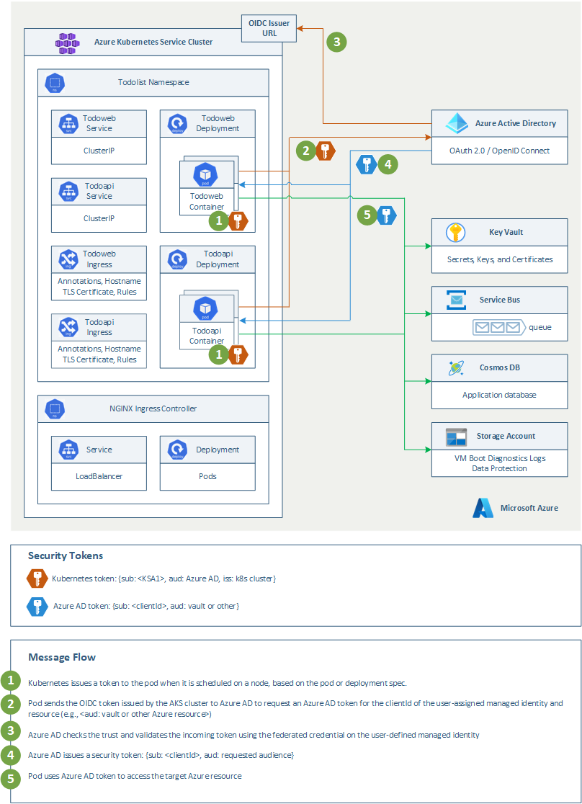

# Use Azure AD workload identity for Kubernetes with a user-assigned managed identity in a .NET Standard application

This project shows how to use [Azure AD workload identity for Kubernetes](https://github.com/Azure/azure-workload-identity) in a [.NET Standard](https://docs.microsoft.com/en-us/dotnet/standard/net-standard?tabs=net-standard-1-0) application running on [Azure Kubernetes Service](https://docs.microsoft.com/en-us/azure/aks/intro-kubernetes). It leverages the public preview capability of [Azure AD workload identity federation](https://docs.microsoft.com/en-us/azure/active-directory/develop/workload-identity-federation) and a [user-assigned managed identity](https://learn.microsoft.com/en-us/azure/active-directory/managed-identities-azure-resources/how-manage-user-assigned-managed-identities?pivots=identity-mi-methods-azp).

## Azure AD Workload Identity for Kubernetes

Today Azure Kubernetes Service (AKS) allows you to assign [managed identities at the pod-level](https://learn.microsoft.com/en-us/azure/aks/use-azure-ad-pod-identity), which has been a preview feature. This pod-managed identity allows the hosted workload or application access to resources through Azure Active Directory (Azure AD). For example, a workload stores files in Azure Storage, and when it needs to access those files, the pod authenticates itself against the resource as an Azure-managed identity. This authentication method has been replaced with [AzureAD workload identity](https://learn.microsoft.com/en-us/azure/active-directory/develop/workload-identities-overview), which integrates with the Kubernetes native capabilities to federate with any external identity provider. This approach is simpler to use and deploy and overcomes several limitations in [Azure AD Pod Identity](https://learn.microsoft.com/en-us/azure/aks/use-azure-ad-pod-identity):

- Removes the scale and performance issues that existed for identity assignment
- Supports Kubernetes clusters hosted in any cloud or on-premises
- Supports both Linux and Windows workloads
- Removes the need for Custom Resource Definitions and pods that intercept [Azure Instance Metadata Service (IMDS)](https://learn.microsoft.com/en-us/azure/virtual-machines/linux/instance-metadata-service) traffic
- Avoids the complicated and error-prone installation steps, such as cluster role assignment from the previous iteration

Azure AD workload identity works especially well with the Azure Identity client library using the [Azure SDK](https://azure.microsoft.com/downloads/) and the [Microsoft Authentication Library (MSAL)](https://learn.microsoft.com/en-us/azure/active-directory/develop/msal-overview ) if you're using [Azure AD registered applications](https://learn.microsoft.com/en-us/azure/active-directory/develop/application-model#register-an-application). Your workload can use any of these libraries to authenticate and access Azure cloud resources seamlessly.

## How does it work?

As shown in the following diagram, the Kubernetes cluster becomes a security token issuer, issuing tokens to Kubernetes Service Accounts. These tokens can be configured to be trusted on Azure AD applications and user-defined managed identities. They can then be exchanged for an Azure AD access token using the [Azure Identity SDKs](https://docs.microsoft.com/en-us/dotnet/api/overview/azure/identity-readme) or the [Microsoft Authentication Library (MSAL)](https://github.com/AzureAD/microsoft-authentication-library-for-dotnet).


In Azure Active Directory, there are two kinds of workload identities: registered applications identities and managed Identities. Azure AD registered application Identities have several powerful features, such as multi-tenancy and user sign-in. These capabilities cause application identities to be closely guarded by administrators. In many organizations, developers don’t have the right permissions to create registered application identities in the Azure Active Directory tenant or modify them. It is challenging for developers to use [workload identity federation](https://learn.microsoft.com/en-us/azure/active-directory/develop/workload-identity-federation) using registered applications as identities since they have to open a ticket and ask the IT administrators to create or update these entities in the corporate Azure Active Directory tenant. For more information on how to implement workload identity federation with registered applications, see [Use Azure AD Workload Identity for Kubernetes with a User-Assigned Managed Identity](https://techcommunity.microsoft.com/t5/fasttrack-for-azure/use-azure-ad-workload-identity-for-kubernetes-in-a-net-standard/ba-p/3576218).

[Managed identities](https://learn.microsoft.com/en-us/azure/active-directory/managed-identities-azure-resources/overview) provide an automatically managed identity in Azure Active Directory for applications to use when connecting to resources that support Azure Active Directory (Azure AD) authentication. Applications can use managed identities to obtain Azure AD tokens without having to manage any credentials. Managed identities were built with developer scenarios in mind. They support only the Client Credentials flow meant for software workloads to identify themselves when accessing other resources. 

A common challenge for developers is the management of secrets, credentials, certificates, and keys used to secure communication between services. Managed identities eliminate the need for developers to manage these credentials. The secrets are managed by the Azure platform, simplifying the developer experience. However, you can only use managed identities for your software workloads running in Azure, for example, in Azure Kubernetes Service, an Azure virtual machine, Azure App Service, or Azure Functions.

Now that  [workload identity federation](https://learn.microsoft.com/en-us/azure/active-directory/develop/workload-identity-federation) is supported on managed identities, you can use these identities for software workloads running outside Azure: including pods running in an on-premises Kubernetes cluster or GitHub Actions workflows. You now have a choice of using managed identities or registered applications, depending on which is more convenient for you. The federation capabilities are identical in both cases: you can add a trust (a federated credential) to either of these identities and use a trusted federated token to get an Azure AD access token for these identities.

Note: Managed Identities come in two kinds: system-assigned and user-assigned. The lifecycle of system-assigned managed identity is tied to an Azure compute resource like VM, so it does not make sense to allow adding a workload identity federation on those identities. Workload identity federation is supported only on user-assigned managed identities.

For more information, see the following resources:

- [Azure Workload Identity open-source project](https://azure.github.io/azure-workload-identity)
- [Use an Azure AD workload identity on Azure Kubernetes Service (AKS](https://learn.microsoft.com/en-us/azure/aks/workload-identity-overview)
- [Deploy and configure workload identity on an Azure Kubernetes Service (AKS) cluster](https://learn.microsoft.com/en-us/azure/aks/workload-identity-deploy-cluster)
- [Modernize application authentication with workload identity sidecar](https://learn.microsoft.com/en-us/azure/aks/workload-identity-migration-sidecar)
- [Tutorial: Use a workload identity with an application on Azure Kubernetes Service (AKS)](https://learn.microsoft.com/en-us/azure/aks/learn/tutorial-kubernetes-workload-identity)
- [Workload identity federation](https://docs.microsoft.com/azure/active-directory/develop/workload-identity-federation)
- [Azure Managed Identities with Workload Identity Federation](https://blog.identitydigest.com/azuread-federate-mi/)
- [Azure AD workload identity federation with Kubernetes](https://blog.identitydigest.com/azuread-federate-k8s/)
- [Azure Active Directory Workload Identity Federation with external OIDC Identy Providers](https://arsenvlad.medium.com/azure-active-directory-workload-identity-federation-with-external-oidc-idp-4f06c9205a26)
- [Minimal Azure AD Workload identity federation](https://cookbook.geuer-pollmann.de/azure/workload-identity-federation)

## Service account labels and annotations

[Azure AD workload identity](https://learn.microsoft.com/en-us/azure/aks/workload-identity-overview) supports the following mappings related to a service account:

- One-to-one where a service account references an Azure AD object.
- Many-to-one where multiple service accounts references the same Azure AD object.
- One-to-many where a service account references multiple Azure AD objects by changing the client ID annotation.

The following tables describe a list of available labels and annotations that can be used to configure the behavior when exchanging the service account token for an Azure AD access token.

### Service account labels

|Label |Description |Recommended value |Required |
|------|------------|------------------|---------|
|`azure.workload.identity/use` |Represents the service account<br> is to be used for workload identity. |true |Yes |

### Service account annotations

|Annotation |Description |Default |
|-----------|------------|--------|
|`azure.workload.identity/client-id` |Represents the Azure AD application<br> client ID to be used with the pod. ||
|`azure.workload.identity/tenant-id` |Represents the Azure tenant ID where the<br> Azure AD application is registered. |AZURE_TENANT_ID environment variable extracted<br> from `azure-wi-webhook-config` ConfigMap.|
|`azure.workload.identity/service-account-token-expiration` |Represents the `expirationSeconds` field for the<br> projected service account token. It's an optional field that you configure to prevent downtime<br> caused by errors during service account token refresh. Kubernetes service account token expiry isn't correlated with Azure AD tokens. Azure AD tokens expire in 24 hours after they're issued. |3600<br> Supported range is 3600-86400.|

### Pod annotations

|Annotation |Description |Default |
|-----------|------------|--------|
|`azure.workload.identity/service-account-token-expiration` |Represents the `expirationSeconds` field for the projected service account token. It's an optional field that you configure to prevent any downtime caused by errors during service account token refresh. Kubernetes service account token expiry isn't correlated with Azure AD tokens. Azure AD tokens expire in 24 hours after they're issued. <sup>1</sup> |3600<br> Supported range is 3600-86400. |
|`azure.workload.identity/skip-containers` |Represents a semi-colon-separated list of containers to skip adding projected service account token volume. For example `container1;container2`. |By default, the projected service account token volume is added to all containers if the service account is labeled with `azure.workload.identity/use: true`. |
|`azure.workload.identity/inject-proxy-sidecar` |Injects a proxy init container and proxy sidecar into the pod. The proxy sidecar is used to intercept token requests to IMDS and acquire an Azure AD token on behalf of the user with federated identity credential. |true |
|`azure.workload.identity/proxy-sidecar-port` |Represents the port of the proxy sidecar. |8080 |

### Prerequisites

- For online deployments, you need an Azure account. If you don't have one, create a [free Azure account](https://azure.microsoft.com/free/?WT.mc_id=A261C142F) before you begin.
- Install [Microsoft Visual Studio 2022 or later](https://www.visualstudio.com/) with .NET Standard 6.0. For more information, see [Visual Studio Tools for Docker](https://docs.microsoft.com/en-us/aspnet/core/publishing/visual-studio-tools-for-docker).
- Install [Docker for Windows](https://docs.docker.com/docker-for-windows/install/) and configure it to use Linux containers.

## Architecture

This sample provides a Bicep and an ARM template to deploy a public or a private AKS cluster with [API Server VNET Integration](https://learn.microsoft.com/en-us/azure/aks/api-server-vnet-integration) with [Azure CNI](https://learn.microsoft.com/en-us/azure/aks/configure-azure-cni) network plugin and [Dynamic IP Allocation](https://learn.microsoft.com/en-us/azure/aks/configure-azure-cni#dynamic-allocation-of-ips-and-enhanced-subnet-support). In a production environment, we strongly recommend deploying a [private AKS cluster](https://docs.microsoft.com/en-us/azure/aks/private-clusters) with [Uptime SLA](https://docs.microsoft.com/en-us/azure/aks/uptime-sla). For more information, see [private AKS cluster with a Public DNS address](https://docs.microsoft.com/en-us/azure/aks/private-clusters#create-a-private-aks-cluster-with-a-public-dns-address). Alternatively, you can deploy a public AKS cluster and secure access to the API server using [authorized IP address ranges](https://learn.microsoft.com/en-us/azure/aks/api-server-authorized-ip-ranges). 


Both the Bicep and ARM template deploy the following Azure resources:

- [Microsoft.ContainerService/managedClusters](https://learn.microsoft.com/en-us/azure/templates/microsoft.containerservice/managedclusters?pivots=deployment-language-bicep): A public or private AKS cluster composed of a:
  - `system` node pool in a dedicated subnet. The default node pool hosts only critical system pods and services. The worker nodes have node taint which prevents application pods from beings scheduled on this node pool.
  - `user` node pool hosting user workloads and artifacts in a dedicated subnet.
- [Microsoft.Network/virtualNetworks](https://docs.microsoft.com/en-us/azure/templates/microsoft.network/virtualnetworks): a new virtual network with six subnets:
  - `SystemSubnet`: this subnet is used for the agent nodes of the `system` node pool.
  - `UserSubnet`: this subnet is used for the agent nodes of the `user` node pool.
  - `PodSubnet`: this subnet is used to allocate private IP addresses to pods dynamically.
  - `ApiServerSubnet`: API Server VNET Integration projects the API server endpoint directly into this delegated subnet in the virtual network where the AKS cluster is deployed.
  - `AzureBastionSubnet`: a subnet for the Azure Bastion Host.
  - `VmSubnet`: a subnet for a jump-box virtual machine used to connect to the (private) AKS cluster and for the private endpoints.
- [Microsoft.ManagedIdentity/userAssignedIdentities](https://learn.microsoft.com/en-us/azure/templates/microsoft.managedidentity/2018-11-30/userassignedidentities?pivots=deployment-language-bicep): a user-defined managed identity used by the AKS cluster to create additional resources like load balancers and managed disks in Azure.
- [Microsoft.Compute/virtualMachines](https://docs.microsoft.com/en-us/azure/templates/microsoft.compute/virtualmachines): Bicep modules create a jump-box virtual machine to manage the private AKS cluster.
- [Microsoft.Network/bastionHosts](https://docs.microsoft.com/en-us/azure/templates/microsoft.network/bastionhosts): a separate Azure Bastion is deployed in the AKS cluster virtual network to provide SSH connectivity to both agent nodes and virtual machines.
- [Microsoft.Storage/storageAccounts](https://docs.microsoft.com/en-us/azure/templates/microsoft.storage/storageaccounts): this storage account is used to store the boot diagnostics logs of both the service provider and service consumer virtual machines. Boot Diagnostics is a debugging feature that allows you to view console output and screenshots to diagnose virtual machine status.
- [Microsoft.ContainerRegistry/registries](https://learn.microsoft.com/en-us/azure/templates/microsoft.containerregistry/registries?pivots=deployment-language-bicep): an Azure Container Registry (ACR) to build, store, and manage container images and artifacts in a private registry for all container deployments.
- [Microsoft.KeyVault/vaults](https://learn.microsoft.com/en-us/azure/templates/microsoft.keyvault/vaults?pivots=deployment-language-bicep): an Azure Key Vault used to store secrets, certificates, and keys that can be mounted as files by pods using [Azure Key Vault Provider for Secrets Store CSI Driver](https://github.com/Azure/secrets-store-csi-driver-provider-azure). For more information, see [Use the Azure Key Vault Provider for Secrets Store CSI Driver in an AKS cluster](https://learn.microsoft.com/en-us/azure/aks/csi-secrets-store-driver) and [Provide an identity to access the Azure Key Vault Provider for Secrets Store CSI Driver](https://learn.microsoft.com/en-us/azure/aks/csi-secrets-store-identity-access). The sample application retrieves parameters stored as secrets in Azure Key Vault.
- [Microsoft.DocumentDB/databaseAccounts](https://learn.microsoft.com/en-us/azure/templates/microsoft.documentdb/databaseaccounts?pivots=deployment-language-bicep): an [Azure Cosmos DB](https://learn.microsoft.com/en-us/azure/cosmos-db/introduction) account, database, and container used by the sample application to store data.
- [Microsoft.ServiceBus/namespaces](https://learn.microsoft.com/en-us/azure/templates/microsoft.servicebus/namespaces?pivots=deployment-language-bicep): an [Azure Service Bus](https://learn.microsoft.com/en-us/azure/service-bus-messaging/service-bus-messaging-overview) namespace and a queue where a message is sent whenever the backend application adds, deletes, or updates an item in the Azure Cosmos DB database.
- [Microsoft.Network/privateEndpoints](https://docs.microsoft.com/en-us/azure/templates/microsoft.network/privateendpoints): an [Azure Private Endpoints](https://docs.microsoft.com/en-us/azure/private-link/private-endpoint-overview) is created for each of the following resources:
  - Azure Container Registry
  - Azure Cosmos DB
  - Azure Service Bus
  - Azure Key Vault
  - Azure Storage Account
  - API Server when deploying a private AKS cluster.
- [Microsoft.Network/privateDnsZones](https://docs.microsoft.com/en-us/azure/templates/microsoft.network/privatednszones): an [Azure Private DNS Zone](https://docs.microsoft.com/en-us/azure/dns/private-dns-overview) is created for each of the following resources:
  - Azure Container Registry
  - Azure Cosmos DB
  - Azure Service Bus
  - Azure Key Vault
  - Azure Storage Account
  - API Server when deploying a private AKS cluster.
- [Microsoft.Network/networkSecurityGroups](https://docs.microsoft.com/en-us/azure/templates/microsoft.network/networksecuritygroups?tabs=bicep): subnets hosting virtual machines and Azure Bastion Hosts are protected by [Azure Network Security Groups](https://docs.microsoft.com/en-us/azure/virtual-network/network-security-groups-overview) that are used to filter inbound and outbound traffic.
- [Microsoft.OperationalInsights/workspaces](https://docs.microsoft.com/en-us/azure/templates/microsoft.operationalinsights/workspaces): a centralized [Azure Log Analytics](https://docs.microsoft.com/en-us/azure/azure-monitor/logs/log-analytics-workspace-overview) workspace is used to collect the diagnostics logs and metrics from all the Azure resources:
  - Azure Kubernetes Service cluster
  - Azure Cosmos DB
  - Azure Service Bus
  - Azure Key Vault
  - Azure Network Security Groups
  - Azure Container Registry
  - Azure Storage Account
  - Azure virtual machine
- [Microsoft.Resources/deploymentScripts](https://learn.microsoft.com/en-us/azure/templates/microsoft.resources/deploymentscripts?pivots=deployment-language-bicep): a deployment script is used to run the `install-helm-charts.sh` Bash script which installs the following packages to the AKS cluster via [Helm](https://helm.sh/). For more information on deployment scripts, see [Use deployment scripts in Bicep](https://learn.microsoft.com/en-us/azure/azure-resource-manager/bicep/deployment-script-bicep)
  - [NGINX Ingress Controller](https://docs.nginx.com/nginx-ingress-controller/)
  - [Cert-Manager](https://cert-manager.io/docs/)
  - [Prometheus](https://prometheus.io/)

> **NOTE**  
> You can find the `architecture.vsdx` file used for the diagram under the `visio` folder.

## Visual Studio Solution

This sample provides a Visual Studio solution under the `src` folder that contains the following projects:

- `TodoWeb`: this project is an ASP.NET Web application written in C# using .NET Standard 6.0. This project contains the code of the frontend application. The user interface is composed of a set of Razor pages that can be used to browse, create, delete, update and see the details of a collection of todo items stored in a Cosmos DB database. The frontend service is configured to send logs, events, traces, requests, dependencies and exceptions to `Application Insights`.
- `TodoApi`:  this project contains the code of an ASP.NET REST API invoked by the frontend application to access the data stored in the Cosmos DB database. Each time a CRUD operation is performed by any of the methods exposed bu the `TodoController`, the backend service sends a notification message to a `Service Bus queue`. You can use my [Service Bus Explorer](https://github.com/paolosalvatori/ServiceBusExplorer) to read messages from the queue. The frontend service is configured to send logs, events, traces, requests, dependencies and exceptions to `Application Insights`. The backend service adopts [Swagger/OpenAPI](https://swagger.io/) to expose a machine-readable representation of its RESTful API.

## Infrastructure Deployment

You can use the `deploy.sh` Bash script under the `bicep` folder to deploy the infrastructure using Bicep modules, or the `deploy.sh` Bash script under the `arm` folder to deploy the infrastructure using the ARM template. In both cases, make sure to change the name of the AKS cluster in the `deploy.sh` Bash script and substitute the placeholders in the `azuredeploy.parameters.json` file with meaningful values. Also, make sure to enable the following public preview features before deploying the ARM template:

- [PodSecurityPolicyPreview](https://docs.microsoft.com/en-us/azure/aks/use-pod-security-policies)
- [RunCommandPreview](https://docs.microsoft.com/en-us/azure/aks/private-clusters#options-for-connecting-to-the-private-cluster)
- [EnablePodIdentityPreview](https://docs.microsoft.com/en-us/azure/aks/use-azure-ad-pod-identity)
- [EnablePrivateClusterPublicFQDN](https://docs.microsoft.com/en-us/azure/aks/private-clusters#create-a-private-aks-cluster-with-a-public-dns-address)
- [PodSubnetPreview"](https://docs.microsoft.com/en-us/azure/aks/configure-azure-cni#dynamic-allocation-of-ips-and-enhanced-subnet-support-preview)
- [AutoUpgradePreview](https://docs.microsoft.com/en-us/azure/aks/upgrade-cluster#set-auto-upgrade-channel)
- [EnableOIDCIssuerPreview](https://docs.microsoft.com/en-us/azure/aks/cluster-configuration#oidc-issuer-preview)
- [EnableWorkloadIdentityPreview](https://learn.microsoft.com/en-us/azure/aks/workload-identity-deploy-cluster)
- [EnableImageCleanerPreview](https://learn.microsoft.com/en-us/azure/aks/image-cleaner?tabs=azure-cli)

The `deploy.sh` deployment script automatically registers the above preview features.

You can deploy the Bicep modules in the `bicep` folder using the `deploy.sh` Bash script in the same folder. Specify a value for the following parameters in the `deploy.sh` script and `main.parameters.json` parameters file before deploying the Bicep modules.

- `prefix`: specifies a prefix for the AKS cluster and other Azure resources.
- `authenticationType`: specifies the type of authentication when accessing the Virtual Machine. `sshPublicKey` is the recommended value. Allowed values: `sshPublicKey` and `password`.
- `vmAdminUsername`: specifies the name of the administrator account of the virtual machine.
- `vmAdminPasswordOrKey`: specifies the SSH Key or password for the virtual machine.
- `aksClusterSshPublicKey`:  specifies the SSH Key or password for AKS cluster agent nodes.
- `aadProfileAdminGroupObjectIDs`: when deploying an AKS cluster with Azure AD and Azure RBAC integration, this array parameter contains the list of Azure AD group object IDs that will have the admin role of the cluster.
- `keyVaultObjectIds`: Specifies the object ID of the service principals to configure in Key Vault access policies.

We suggest reading sensitive configuration data such as passwords or SSH keys from a pre-existing Azure Key Vault resource. For more information, see [Use Azure Key Vault to pass secure parameter value during Bicep deployment](https://docs.microsoft.com/en-us/azure/azure-resource-manager/bicep/key-vault-parameter?tabs=azure-cli).

## Application Architecture

The following diagram shows the architecture of the application on an AKS cluster with the [OIDC Issuer](https://docs.microsoft.com/en-us/azure/aks/cluster-configuration#oidc-issuer-preview) and [Workload Identity](https://learn.microsoft.com/en-us/azure/aks/workload-identity-deploy-cluster) enabled. The figure also shows how both the frontend and backend applications exchange the security tokens issued by the AKS cluster to their service account with a security token issued by Azure AD to the federated managed identity and how they use these tokens to access the following Azure AD protected resources:

- Azure Key Vault
- Azure CosmosDB
- Azure Storage Account
- Azure Service Bus



There are four steps to get the sample working end-to-end in a Kubernetes cluster:

- Configure the AKS cluster to issue tokens. An OIDC discovery document is published to allow validation of these tokens.
- Configure their deployments to use a Kubernetes service account federated with a user-assigned managed identity.
- Configure the user-assigned managed identity to trust the security tokens issued by the OIDC issuer of the AKS cluster.
- At runtime, AKS-issued tokens are exchanged for Azure AD tokens, and used to access Azure AD protected resources.

## Azure Identity SDK

The sample `Todolist` application makes use of the [Azure Identity client library for .NET](https://docs.microsoft.com/en-us/dotnet/api/overview/azure/identity-readme) with the [DefaultAzureCredential](https://docs.microsoft.com/en-us/dotnet/api/overview/azure/identity-readme#key-concepts) to authenticate via Azure AD Workload Identity and get a security token to access the following services:

- Azure Key Vault
- Azure CosmosDB
- Azure Storage Account
- Azure Service Bus

Here are some snippets from the application code that show how to access Azure resources using the [Azure Identity client library for .NET](https://docs.microsoft.com/en-us/dotnet/api/overview/azure/identity-readme) and [Azure AD workload identity for Kubernetes](https://github.com/Azure/azure-workload-identity).

### Azure Key Vault

```csharp
using Azure.Identity;
using Azure.Security.KeyVault.Secrets;

...

// Configure Key Vault configuration provider
var keyVaultUrl = $"https://{keyVaultName}.vault.azure.net/";
var secretClient = new SecretClient(new Uri(keyVaultUrl), new DefaultAzureCredential());
configurationBuilder.AddAzureKeyVault(secretClient, new KeyVaultSecretManager());

// Read configuration from Key Vault
builtConfig = configurationBuilder.Build();
```

### Azure Cosmos DB

```csharp
using Microsoft.Azure.Cosmos;
using Azure.Identity;

...

// Create CosmosClient object
_cosmosClient = new CosmosClient(
    _repositoryServiceOptions.CosmosDb.EndpointUri, 
    new DefaultAzureCredential(),
    new CosmosClientOptions
    {
        RequestTimeout = TimeSpan.FromMinutes(5),
        ConnectionMode = ConnectionMode.Gateway
    });
```

### Azure Storage Account

```csharp
using Azure.Storage.Blobs;
using Azure.Identity;

...

// Construct the blob container endpoint from the arguments.
var containerEndpoint = string.Format("https://{0}.blob.core.windows.net/{1}",
                                      accountName,
                                      containerName);
// Get a credential and create a service client object for the blob container.
containerClient = new BlobContainerClient(new Uri(containerEndpoint),
                                          new DefaultAzureCredential());
```

### Azure Service Bus

```csharp
using Azure.Messaging.ServiceBus;
using Azure.Identity;

...

// Create ServiceBusClient object
_serviceBusClient = new ServiceBusClient($"{_options.ServiceBus.Namespace}.servicebus.windows.net", 
                                         new DefaultAzureCredential());
```

## Application Configuration

The Bicep and ARM templates create all the necessary secrets used by both the frontend and backend applications as shown in the picture below:


Azure Key Vault secret names are limited to alphanumeric characters and dashes. Hierarchical values in ASP.NET configuration sections use -- (two dashes) as a delimiter, as colons aren't allowed in key vault secret names. Colons delimit a section from a subkey in ASP.NET Core configuration. The two-dash sequence is replaced with a colon when the secrets are loaded into the app's configuration. For more information, see [Secret storage in the Production environment with Azure Key Vault](https://docs.microsoft.com/en-us/aspnet/core/security/key-vault-configuration?view=aspnetcore-6.0#secret-storage-in-the-production-environment-with-azure-key-vault).

The following table describes the application settings:

| Name | Description |
|:---|:---|
| ApplicationInsights--InstrumentationKey | Specifies the `Instrumentation Key` of the `Azure Application Insights` resource used by both the frontend and backend services. |
| DataProtection--BlobStorage--AccountName | Specifies the name of the `Azure Storage Account` used to store the boot diagnostics logs or the virtual machine and the files used by the sample ASP.NET frontend and backend applications for [ASP.NET Data Protection](https://docs.microsoft.com/en-us/aspnet/core/security/data-protection/introduction?view=aspnetcore-6.0). This setting is used when the `DataProtection--BlobStorage--UseAzureCredential` is set to `true`. |
| DataProtection--BlobStorage--ConnectionString | Contains the connection string to the `Azure Storage Account`. This setting is used when the `DataProtection--BlobStorage--UseAzureCredential` is set to `false`. |
| DataProtection--BlobStorage--UseAzureCredential | Specifies whether the frontend and backend services should use [Azure Identity client library for .NET](https://docs.microsoft.com/en-us/dotnet/api/overview/azure/identity-readme) with the [DefaultAzureCredential](https://docs.microsoft.com/en-us/dotnet/api/overview/azure/identity-readme#key-concepts) to authenticate via Azure AD Workload Identity and get a security token to access the `Azure Storage Account`. If the value of this setting is equal to `false`, the frontend and backend applications will use the connection string of the `Azure Storage Account` contained in the `DataProtection--BlobStorage--ConnectionString` secret. |
| NotificationService--ServiceBus--ConnectionString | Contains the connection string of the `Azure Service Bus` namespace. This setting is used when the `NotificationService--ServiceBus--UseAzureCredential` is set to `false`. |
| NotificationService--ServiceBus--Namespace | Contains the name of the `Azure Service Bus` namespace. This setting is used when the `NotificationService--ServiceBus--UseAzureCredential` is set to `true`. |
| NotificationService--ServiceBus--QueueName | Contains the name of the queue in the `Azure Service Bus` namespace where the backend service sends a message any time a todo-item is created in the `Azure Cosmos DB` database by the backend service. |
| NotificationService--ServiceBus--UseAzureCredential | Specifies whether the frontend and backend services should use [Azure Identity client library for .NET](https://docs.microsoft.com/en-us/dotnet/api/overview/azure/identity-readme) with the [DefaultAzureCredential](https://docs.microsoft.com/en-us/dotnet/api/overview/azure/identity-readme#key-concepts) to authenticate via Azure AD Workload Identity and get a security token to access the `Azure Service Bus namespace`. If the value of this setting is equal to `false`, the frontend and backend applications will use the connection string of the `Azure Service Bus namespace` contained in the `NotificationService--ServiceBus--ConnectionString` secret. |
| RepositoryService--CosmosDb--CollectionName | Specifies the name of the `Azure Cosmos DB` container. |
| RepositoryService--CosmosDb--DatabaseName | Specifies the name of the `Azure Cosmos DB` database. |
| RepositoryService--CosmosDb--EndpointUri | Specifies the endpoint URI of the `Azure Cosmos DB` account. |
| RepositoryService--CosmosDb--PrimaryKey | Contains the primary key of the `Azure Cosmos DB` account. This setting is used when the `RepositoryService--CosmosDb--UseAzureCredential` is set to `false`.  |
| RepositoryService--CosmosDb--UseAzureCredential | Specifies whether the frontend and backend services should use [Azure Identity client library for .NET](https://docs.microsoft.com/en-us/dotnet/api/overview/azure/identity-readme) with the [DefaultAzureCredential](https://docs.microsoft.com/en-us/dotnet/api/overview/azure/identity-readme#key-concepts) to authenticate via Azure AD Workload Identity and get a security token to access the `Azure Cosmos DB account`. If the value of this setting is equal to `false`, the frontend and backend applications will use the primary key of the `Azure Cosmos DB` account contained in the `RepositoryService--CosmosDb--PrimaryKey` secret. |

## Application Local Debugging

If you want to debug the application locally, you need to install [Microsoft Visual Studio 2022 or later](https://www.visualstudio.com/) with .NET Standard 6.0. For more information, see [Visual Studio Tools for Docker](https://docs.microsoft.com/en-us/aspnet/core/publishing/visual-studio-tools-for-docker). In addition, make sure to change the values in the `docker-compose.override.yml` as follows:

- You can use the same or an alternative Azure AD application to access the secrets from Key vault that contain the credentials to access the Azure Service Bus namespace, Azure Cosmos DB, and Azure Storage Account. In this case, make sure to specify the name of the Key Vault in the corresponding environment variable and assign the `List` and `Get` permissions to the Azure AD application via access policies or Azure RBAC.
- Alternatively, you can use the environment variables to specify the credentials to access the Azure Service Bus namespace, Azure Cosmos DB, and Azure Storage Account in the `docker-compose.override.yml` file (not recommended).

## Application Deployment

The `00-variables.sh` contains the variables used by all the scripts necessary to deploy the sample. The first step consists in assigning a proper value to each variable before starting with the application deploying.

```bash
#!/bin/bash

# Container Images
frontendContainerImageTag="v2"
backendContainerImageTag="v2"

# Azure Resources
location="<azure-region>"
resourceGroupName="<azure-resource-group-name>"

# Azure Managed Identity
managedIdentityName="<azure-user-assigned-managed-identity-name>"

# Kubernetes Service account
workloadNamespace="todo"
workloadServiceAccountName="todo-sa"

# Variables for the federated identity name
federatedIdentityName="TodoWorkloadFederatedIdentity"

# Azure Container Registry
acrName="<azure-container-registry-name>"

# Azure Kubernetes Service
aksClusterName="<azure-kubernetes-service-name>"

# Azure Key Vault 
keyVaultName="<azure-key-vault-name>"
keyVaultSku="Standard"

# Azure Cosmos DB
cosmosDbAccountName="<azure-cosmos-db-account-name>"
cosmosDbUseAzureCredential="true"
cosmosDbDatabaseName="TodoApiDb"
cosmosDbCollectionName="TodoApiCollection"

# Azure Service Bus
serviceBusNamespace="<azure-service-bus-namespace-name>"
serviceBusUseAzureCredential="true"
serviceBusQueueName="todoapi"

# Azure Application Insights
applicationInsightsName="<azure-application-insights-name>"

# Azure Storage Account
storageAccountName="<azure-storage-account-name>"
storageUseAzureCredential="true"

# Azure Subscription and Tenant
subscriptionId=$(az account show --query id --output tsv)
subscriptionName=$(az account show --query name --output tsv)
tenantId=$(az account show --query tenantId --output tsv)

# NGINX
nginxNamespace="ingress-basic"
nginxRepoName="ingress-nginx"
nginxRepoUrl="https://kubernetes.github.io/ingress-nginx"
nginxChartName="ingress-nginx"
nginxReleaseName="nginx-ingress"
nginxReplicaCount=2

# Azure DNS
dnsZoneName="<azure-dns-zone-name>"
dnsZoneResourceGroupName="<azure-dns-zone-resource-group-name>"
frontendSubdomain="<frontend-dns-subdomain>"
backendSubdomain="<backend-dns-subdomain>"

# Certificate Manager
certManagerNamespace="cert-manager"
certManagerRepoName="jetstack"
certManagerRepoUrl="https://charts.jetstack.io"
certManagerChartName="cert-manager"
certManagerReleaseName="cert-manager"
email="paolos@microsoft.com"
clusterIssuer="letsencrypt-nginx"
template="cluster-issuer.yml"

# Default Backend
defaultBackendTemplate="default-backend.yml"

# Workload
workloadRelease="todo"
workloadChart="../chart"

frontendContainerImageName="${acrName,,}.azurecr.io/todoweb"
frontendHostName="${frontendSubdomain,,}.${dnsZoneName,,}"
frontendReplicaCount=3

backendContainerImageName="${acrName,,}.azurecr.io/todoapi"
backendHostName="${backendSubdomain,,}.${dnsZoneName,,}"
backendReplicaCount=3

workloadDeploymentTemplate="todolist-deployments.yml"
workloadServiceTemplate="todolist-services.yml"
workloadHpaTemplate="todolist-hpas.yml"

configMapName="todolist-configmap"
configMapTemplate="config-map.yml"

aspNetCoreEnvironment="Docker"
todoApiServiceEndpointUri="todolist-api"
todoWebDataProtectionBlobStorageContainerName="todoweb"
todoApiDataProtectionBlobStorageContainerName="todoapi"

frontendIngressName="ingress-frontend"
frontendIngressTemplate="ingress-frontend.yml"
frontendSecretName="tls-frontend"
frontendServiceName="todolist-web"
frontendPort="80"

backendIngressName="ingress-backend"
backendIngressTemplate="ingress-backend.yml"
backendSecretName="tls-backend"
backendServiceName="todolist-api"
backendPort="80"
```

Run the `scripts/01-build-container-images.sh` script to build the Linux container images for the frontend and backend applications using Docker.

```bash
#!/bin/bash

#Variables
source ./00-variables.sh

cd ../src/TodoApi
docker build -t todoapi:$frontendContainerImageTag -f Dockerfile ..
cd ../TodoWeb
docker build -t todoweb:$backendContainerImageTag -f Dockerfile ..
```

Run the `scripts/02-push-docker-images.sh` script to push the container images to your Azure Container Registry.

```bash
#!/bin/bash

# Variables
source ./00-variables.sh

# Login to ACR
az acr login --name ${acrName,,}

# Retrieve ACR login server. Each container image needs to be tagged with the loginServer name of the registry. 
loginServer=$(az acr show --name ${acrName,,} --query loginServer --output tsv)

# Tag the local todoapi image with the loginServer of ACR
docker tag todoapi:$backendContainerImageTag $loginServer/todoapi:$backendContainerImageTag

# Push todoapi container image to ACR
docker push $loginServer/todoapi:$backendContainerImageTag

# Tag the local todoweb image with the loginServer of ACR
docker tag todoweb:$frontendContainerImageTag $loginServer/todoweb:$frontendContainerImageTag

# Push todoweb container image to ACR
docker push $loginServer/todoweb:$frontendContainerImageTag
```

Run the `scripts/03-enable-oidc.sh` script on an existing AKS cluster, to register and enable the [OIDC Issuer](https://docs.microsoft.com/en-us/azure/aks/cluster-configuration#oidc-issuer-preview) feature. Running this script is unnecessary if you deployed the AKS cluster using the bicep modules in the `bicep` folder.

```bash
#!/bin/bash

# For more information, see https://docs.microsoft.com/en-us/azure/aks/cluster-configuration#oidc-issuer-preview

# Variables
source ./00-variables.sh

# Install aks-preview Azure extension
echo "Checking if [aks-preview] extension is already installed..."
az extension show --name aks-preview &>/dev/null

if [[ $? == 0 ]]; then
  echo "[aks-preview] extension is already installed"

  # Update the extension to make sure you have the latest version installed
  echo "Updating [aks-preview] extension..."
  az extension update --name aks-preview &>/dev/null
else
  echo "[aks-preview] extension is not installed. Installing..."

  # Install aks-preview extension
  az extension add --name aks-preview 1>/dev/null

  if [[ $? == 0 ]]; then
    echo "[aks-preview] extension successfully installed"
  else
    echo "Failed to install [aks-preview] extension"
    exit
  fi
fi

# Registering AKS feature extensions
aksExtensions=("EnableOIDCIssuerPreview")
registeringExtensions=()
for aksExtension in ${aksExtensions[@]}; do
  echo "Checking if [$aksExtension] extension is already registered..."
  extension=$(az feature list -o table --query "[?contains(name, 'Microsoft.ContainerService/$aksExtension') && @.properties.state == 'Registered'].{Name:name}" --output tsv)
  if [[ -z $extension ]]; then
    echo "[$aksExtension] extension is not registered."
    echo "Registering [$aksExtension] extension..."
    az feature register --name $aksExtension --namespace Microsoft.ContainerService
    registeringExtensions+=("$aksExtension")
    ok=1
  else
    echo "[$aksExtension] extension is already registered."
  fi
done
delay=1
for aksExtension in ${registeringExtensions[@]}; do
  echo -n "Checking if [$aksExtension] extension is already registered..."
  while true; do
    extension=$(az feature list -o table --query "[?contains(name, 'Microsoft.ContainerService/$aksExtension') && @.properties.state == 'Registered'].{Name:name}" --output tsv)
    if [[ -z $extension ]]; then
      echo -n "."
      sleep $delay
    else
      echo "."
      break
    fi
  done
done
# Check if extensions have been successfully registered
if [[ $ok == 1 ]]; then
  echo "Refreshing the registration of the Microsoft.ContainerService resource provider..."
  az provider register --namespace Microsoft.ContainerService
  echo "Microsoft.ContainerService resource provider registration successfully refreshed"
fi

# Check if the OIDC discovery endpoint has been already enabled
echo "Check if the OIDC discovery endpoint has been already enabled on the [$aksClusterName] AKS cluster..."
enabled=$(az aks show \
  --name $aksClusterName \
  --resource-group $resourceGroupName \
  --query oidcIssuerProfile.enabled \
  --output tsv \
  --only-show-errors)

if [[ $enabled == 'true' ]]; then
  echo "The OIDC discovery endpoint has been already enabled on the [$aksClusterName] AKS cluster"
else
  echo "The OIDC discovery endpoint has not been already enabled on the [$aksClusterName] AKS cluster"
  echo "Enabling the OIDC discovery endpoint on the [$aksClusterName] AKS cluster"

  az aks update \
    --name $aksClusterName \
    --resource-group $resourceGroupName \
    --enable-oidc-issuer \
    --only-show-errors

  if [[ $? == 0 ]]; then
    echo "The OIDC discovery endpoint has been successfully enabled on the [$aksClusterName] AKS cluster"
  else
    echo "Failed to enable the OIDC discovery endpoint on the [$aksClusterName] AKS cluster"
  fi
fi
```

Run the `scripts/04-enable-workload-identity.sh` script on an existing AKS cluster, to register and enable the [Workload Identity](https://learn.microsoft.com/en-us/azure/aks/workload-identity-deploy-cluster) feature. Running this script is unnecessary if you deployed the AKS cluster using the bicep modules in the `bicep` folder.

```bash
#!/bin/bash

# For more information, see https://docs.microsoft.com/en-us/azure/aks/cluster-configuration#oidc-issuer-preview

# Variables
source ./00-variables.sh

# Install aks-preview Azure extension
echo "Checking if [aks-preview] extension is already installed..."
az extension show --name aks-preview &>/dev/null

if [[ $? == 0 ]]; then
  echo "[aks-preview] extension is already installed"

  # Update the extension to make sure you have the latest version installed
  echo "Updating [aks-preview] extension..."
  az extension update --name aks-preview &>/dev/null
else
  echo "[aks-preview] extension is not installed. Installing..."

  # Install aks-preview extension
  az extension add --name aks-preview 1>/dev/null

  if [[ $? == 0 ]]; then
    echo "[aks-preview] extension successfully installed"
  else
    echo "Failed to install [aks-preview] extension"
    exit
  fi
fi

# Registering AKS feature extensions
aksExtensions=("EnableWorkloadIdentityPreview")
registeringExtensions=()
for aksExtension in ${aksExtensions[@]}; do
  echo "Checking if [$aksExtension] extension is already registered..."
  extension=$(az feature list -o table --query "[?contains(name, 'Microsoft.ContainerService/$aksExtension') && @.properties.state == 'Registered'].{Name:name}" --output tsv)
  if [[ -z $extension ]]; then
    echo "[$aksExtension] extension is not registered."
    echo "Registering [$aksExtension] extension..."
    az feature register --name $aksExtension --namespace Microsoft.ContainerService
    registeringExtensions+=("$aksExtension")
    ok=1
  else
    echo "[$aksExtension] extension is already registered."
  fi
done
delay=1
for aksExtension in ${registeringExtensions[@]}; do
  echo -n "Checking if [$aksExtension] extension is already registered..."
  while true; do
    extension=$(az feature list -o table --query "[?contains(name, 'Microsoft.ContainerService/$aksExtension') && @.properties.state == 'Registered'].{Name:name}" --output tsv)
    if [[ -z $extension ]]; then
      echo -n "."
      sleep $delay
    else
      echo "."
      break
    fi
  done
done
# Check if extensions have been successfully registered
if [[ $ok == 1 ]]; then
  echo "Refreshing the registration of the Microsoft.ContainerService resource provider..."
  az provider register --namespace Microsoft.ContainerService
  echo "Microsoft.ContainerService resource provider registration successfully refreshed"
fi

# Check if the workload identity has been already enabled
echo "Check if the workload identity has been already enabled on the [$aksClusterName] AKS cluster..."
enabled=$(az aks show \
  --name $aksClusterName \
  --resource-group $resourceGroupName \
  --query oidcIssuerProfile.enabled \
  --output tsv \
  --only-show-errors)

if [[ $enabled == 'true' ]]; then
  echo "The workload identity has been already enabled on the [$aksClusterName] AKS cluster"
else
  echo "The workload identity has not been already enabled on the [$aksClusterName] AKS cluster"
  echo "Enabling the workload identity on the [$aksClusterName] AKS cluster"

  az aks update \
    --name $aksClusterName \
    --resource-group $resourceGroupName \
    --enable-workload-identity \
    --only-show-errors

  if [[ $? == 0 ]]; then
    echo "The workload identity has been successfully enabled on the [$aksClusterName] AKS cluster"
  else
    echo "Failed to enable the workload identity on the [$aksClusterName] AKS cluster"
  fi
fi
```

Run the `scripts/05-install-azure-ad-workload-cli.sh` script to install the [Azure AD Workload CLI (azwi)](https://azure.github.io/azure-workload-identity/docs/installation/azwi.html). `azwi` is a utility CLI that helps manage Azure AD Workload Identity and automate error-prone operations:

- Generate the JWKS document from a list of public keys
- Streamline the creation and deletion of the following resources:
  - AAD applications
  - Kubernetes service accounts
  -Federated identities
  - Azure role assignments

```bash
#!/bin/bash

brew install Azure/azure-workload-identity/azwi
```

The Bicep and ARM templates automatically create the secrets used by the frontend and backend services. Hence, running this script is unnecessary if you deployed the AKS cluster using the bicep modules in the `bicep` folder. If you want to deploy the sample on your AKS cluster, you can use the `scripts/06-create-key-vault-and-secrets.sh` script to create the secrets in your Azure Key Vault.

```bash
#!/bin/bash

# Variables
source ./00-variables.sh

# Check if the resource group already exists
echo "Checking if [$resourceGroupName] resource group actually exists in the [$subscriptionName] subscription..."

az group show --name $resourceGroupName &> /dev/null

if [[ $? != 0 ]]; then
	echo "No [$resourceGroupName] resource group actually exists in the [$subscriptionName] subscription"
    echo "Creating [$resourceGroupName] resource group in the [$subscriptionName] subscription..."
    
    # create the resource group
    az group create --name $resourceGroupName --location $location 1> /dev/null
        
    if [[ $? == 0 ]]; then
        echo "[$resourceGroupName] resource group successfully created in the [$subscriptionName] subscription"
    else
        echo "Failed to create [$resourceGroupName] resource group in the [$subscriptionName] subscription"
        exit
    fi
else
	echo "[$resourceGroupName] resource group already exists in the [$subscriptionName] subscription"
fi

# Check if the key vault already exists
echo "Checking if [$keyVaultName] key vault actually exists in the [$subscriptionName] subscription..."

az keyvault show --name $keyVaultName --resource-group $resourceGroupName &> /dev/null

if [[ $? != 0 ]]; then
	echo "No [$keyVaultName] key vault actually exists in the [$subscriptionName] subscription"
    echo "Creating [$keyVaultName] key vault in the [$subscriptionName] subscription..."
    
    # create the key vault
    az keyvault create \
    --name $keyVaultName \
    --resource-group $resourceGroupName \
    --location $location \
    --enabled-for-deployment \
    --enabled-for-disk-encryption \
    --enabled-for-template-deployment \
    --sku $keyVaultSku 1> /dev/null
        
    if [[ $? == 0 ]]; then
        echo "[$keyVaultName] key vault successfully created in the [$subscriptionName] subscription"
    else
        echo "Failed to create [$keyVaultName] key vault in the [$subscriptionName] subscription"
        exit
    fi
else
	echo "[$keyVaultName] key vault already exists in the [$subscriptionName] subscription"
fi

# Check if the secret already exists
cosmosDbEndpointUriSecretName="RepositoryService--CosmosDb--EndpointUri"
cosmosDbEndpointUriSecretValue="https://${cosmosDbAccountName}.documents.azure.com:443/"

echo "Checking if [$cosmosDbEndpointUriSecretName] secret actually exists in the [$keyVaultName] key vault..."

az keyvault secret show --name $cosmosDbEndpointUriSecretName --vault-name $keyVaultName &> /dev/null

if [[ $? != 0 ]]; then
	echo "No [$cosmosDbEndpointUriSecretName] secret actually exists in the [$keyVaultName] key vault"
    echo "Creating [$cosmosDbEndpointUriSecretName] secret in the [$keyVaultName] key vault..."
    
    # create the secret
    az keyvault secret set \
    --name $cosmosDbEndpointUriSecretName \
    --vault-name $keyVaultName \
    --value $cosmosDbEndpointUriSecretValue 1> /dev/null
        
    if [[ $? == 0 ]]; then
        echo "[$cosmosDbEndpointUriSecretName] secret successfully created in the [$keyVaultName] key vault"
    else
        echo "Failed to create [$cosmosDbEndpointUriSecretName] secret in the [$keyVaultName] key vault"
        exit
    fi
else
	echo "[$cosmosDbEndpointUriSecretName] secret already exists in the [$keyVaultName] key vault"
fi

# Get Cosmos DB account primary key
cosmosDBPrimaryKey=$(az cosmosdb keys list \
  --name $cosmosDbAccountName \
  --resource-group $resourceGroupName \
  --type keys \
  --query primaryMasterKey \
  --output tsv)

# Check if the secret already exists
cosmosDbPrimaryKeySecretName="RepositoryService--CosmosDb--PrimaryKey"
cosmosDbPrimaryKeySecretValue=$cosmosDBPrimaryKey

echo "Checking if [$cosmosDbPrimaryKeySecretName] secret actually exists in the [$keyVaultName] key vault..."

az keyvault secret show --name $cosmosDbPrimaryKeySecretName --vault-name $keyVaultName &> /dev/null

if [[ $? != 0 && -n $cosmosDBPrimaryKey ]]; then
	echo "No [$cosmosDbPrimaryKeySecretName] secret actually exists in the [$keyVaultName] key vault"
    echo "Creating [$cosmosDbPrimaryKeySecretName] secret in the [$keyVaultName] key vault..."
    
    # create the secret
    az keyvault secret set \
    --name $cosmosDbPrimaryKeySecretName \
    --vault-name $keyVaultName \
    --value $cosmosDbPrimaryKeySecretValue 1> /dev/null
        
    if [[ $? == 0 ]]; then
        echo "[$cosmosDbPrimaryKeySecretName] secret successfully created in the [$keyVaultName] key vault"
    else
        echo "Failed to create [$cosmosDbPrimaryKeySecretName] secret in the [$keyVaultName] key vault"
        exit
    fi
else
	echo "[$cosmosDbPrimaryKeySecretName] secret already exists in the [$keyVaultName] key vault"
fi

# Check if the secret already exists
cosmosDbUseAzureCredentialSecretName="RepositoryService--CosmosDb--UseAzureCredential"
cosmosDbUseAzureCredentialSecretValue=$cosmosDbUseAzureCredential

echo "Checking if [$cosmosDbUseAzureCredentialSecretName] secret actually exists in the [$keyVaultName] key vault..."

az keyvault secret show --name $cosmosDbUseAzureCredentialSecretName --vault-name $keyVaultName &> /dev/null

if [[ $? != 0 ]]; then
	echo "No [$cosmosDbUseAzureCredentialSecretName] secret actually exists in the [$keyVaultName] key vault"
    echo "Creating [$cosmosDbUseAzureCredentialSecretName] secret in the [$keyVaultName] key vault..."
    
    # create the secret
    az keyvault secret set \
    --name $cosmosDbUseAzureCredentialSecretName \
    --vault-name $keyVaultName \
    --value $cosmosDbUseAzureCredentialSecretValue 1> /dev/null
        
    if [[ $? == 0 ]]; then
        echo "[$cosmosDbUseAzureCredentialSecretName] secret successfully created in the [$keyVaultName] key vault"
    else
        echo "Failed to create [$cosmosDbUseAzureCredentialSecretName] secret in the [$keyVaultName] key vault"
        exit
    fi
else
	echo "[$cosmosDbUseAzureCredentialSecretName] secret already exists in the [$keyVaultName] key vault"
fi

# Check if the secret already exists
cosmosDbDatabaseNameSecretName="RepositoryService--CosmosDb--DatabaseName"
cosmosDbDatabaseNameSecretValue=$cosmosDbDatabaseName

echo "Checking if [$cosmosDbDatabaseNameSecretName] secret actually exists in the [$keyVaultName] key vault..."

az keyvault secret show --name $cosmosDbDatabaseNameSecretName --vault-name $keyVaultName &> /dev/null

if [[ $? != 0 ]]; then
	echo "No [$cosmosDbDatabaseNameSecretName] secret actually exists in the [$keyVaultName] key vault"
    echo "Creating [$cosmosDbDatabaseNameSecretName] secret in the [$keyVaultName] key vault..."
    
    # create the secret
    az keyvault secret set \
    --name $cosmosDbDatabaseNameSecretName \
    --vault-name $keyVaultName \
    --value $cosmosDbDatabaseNameSecretValue 1> /dev/null
        
    if [[ $? == 0 ]]; then
        echo "[$cosmosDbDatabaseNameSecretName] secret successfully created in the [$keyVaultName] key vault"
    else
        echo "Failed to create [$cosmosDbDatabaseNameSecretName] secret in the [$keyVaultName] key vault"
        exit
    fi
else
	echo "[$cosmosDbDatabaseNameSecretName] secret already exists in the [$keyVaultName] key vault"
fi

# Check if the secret already exists
cosmosDbCollectionNameSecretName="RepositoryService--CosmosDb--CollectionName"
cosmosDbCollectionNameSecretValue=$cosmosDbCollectionName

echo "Checking if [$cosmosDbCollectionNameSecretName] secret actually exists in the [$keyVaultName] key vault..."

az keyvault secret show --name $cosmosDbCollectionNameSecretName --vault-name $keyVaultName &> /dev/null

if [[ $? != 0 ]]; then
	echo "No [$cosmosDbCollectionNameSecretName] secret actually exists in the [$keyVaultName] key vault"
    echo "Creating [$cosmosDbCollectionNameSecretName] secret in the [$keyVaultName] key vault..."
    
    # create the secret
    az keyvault secret set \
    --name $cosmosDbCollectionNameSecretName \
    --vault-name $keyVaultName \
    --value $cosmosDbCollectionNameSecretValue 1> /dev/null
        
    if [[ $? == 0 ]]; then
        echo "[$cosmosDbCollectionNameSecretName] secret successfully created in the [$keyVaultName] key vault"
    else
        echo "Failed to create [$cosmosDbCollectionNameSecretName] secret in the [$keyVaultName] key vault"
        exit
    fi
else
	echo "[$cosmosDbCollectionNameSecretName] secret already exists in the [$keyVaultName] key vault"
fi

# Get Service Bus namespace connection string
serviceBusConnectionString=$(az servicebus namespace authorization-rule keys list \
  --resource-group $resourceGroupName \
  --namespace-name $serviceBusNamespace \
  --name RootManageSharedAccessKey \
  --query primaryConnectionString \
  --output tsv)

# Check if the secret already exists
serviceBusConnectionStringSecretName="NotificationService--ServiceBus--ConnectionString"
serviceBusConnectionStringSecretValue=$serviceBusConnectionString

echo "Checking if [$serviceBusConnectionStringSecretName] secret actually exists in the [$keyVaultName] key vault..."

az keyvault secret show --name $serviceBusConnectionStringSecretName --vault-name $keyVaultName &> /dev/null

if [[ $? != 0 && -n $serviceBusConnectionString ]]; then
	echo "No [$serviceBusConnectionStringSecretName] secret actually exists in the [$keyVaultName] key vault"
    echo "Creating [$serviceBusConnectionStringSecretName] secret in the [$keyVaultName] key vault..."
    
    # create the secret
    az keyvault secret set \
    --name $serviceBusConnectionStringSecretName \
    --vault-name $keyVaultName \
    --value $serviceBusConnectionStringSecretValue 1> /dev/null
        
    if [[ $? == 0 ]]; then
        echo "[$serviceBusConnectionStringSecretName] secret successfully created in the [$keyVaultName] key vault"
    else
        echo "Failed to create [$serviceBusConnectionStringSecretName] secret in the [$keyVaultName] key vault"
        exit
    fi
else
	echo "[$serviceBusConnectionStringSecretName] secret already exists in the [$keyVaultName] key vault"
fi

# Check if the secret already exists
serviceBusNamespaceSecretName="NotificationService--ServiceBus--Namespace"
serviceBusNamespaceSecretValue=$serviceBusNamespace

echo "Checking if [$serviceBusNamespaceSecretName] secret actually exists in the [$keyVaultName] key vault..."

az keyvault secret show --name $serviceBusNamespaceSecretName --vault-name $keyVaultName &> /dev/null

if [[ $? != 0 ]]; then
	echo "No [$serviceBusNamespaceSecretName] secret actually exists in the [$keyVaultName] key vault"
    echo "Creating [$serviceBusNamespaceSecretName] secret in the [$keyVaultName] key vault..."
    
    # create the secret
    az keyvault secret set \
    --name $serviceBusNamespaceSecretName \
    --vault-name $keyVaultName \
    --value $serviceBusNamespaceSecretValue 1> /dev/null
        
    if [[ $? == 0 ]]; then
        echo "[$serviceBusNamespaceSecretName] secret successfully created in the [$keyVaultName] key vault"
    else
        echo "Failed to create [$serviceBusNamespaceSecretName] secret in the [$keyVaultName] key vault"
        exit
    fi
else
	echo "[$serviceBusNamespaceSecretName] secret already exists in the [$keyVaultName] key vault"
fi

# Check if the secret already exists
serviceBusUseAzureCredentialSecretName="NotificationService--ServiceBus--UseAzureCredential"
serviceBusUseAzureCredentialSecretValue=$serviceBusUseAzureCredential

echo "Checking if [$serviceBusUseAzureCredentialSecretName] secret actually exists in the [$keyVaultName] key vault..."

az keyvault secret show --name $serviceBusUseAzureCredentialSecretName --vault-name $keyVaultName &> /dev/null

if [[ $? != 0 ]]; then
	echo "No [$serviceBusUseAzureCredentialSecretName] secret actually exists in the [$keyVaultName] key vault"
    echo "Creating [$serviceBusUseAzureCredentialSecretName] secret in the [$keyVaultName] key vault..."
    
    # create the secret
    az keyvault secret set \
    --name $serviceBusUseAzureCredentialSecretName \
    --vault-name $keyVaultName \
    --value $serviceBusUseAzureCredentialSecretValue 1> /dev/null
        
    if [[ $? == 0 ]]; then
        echo "[$serviceBusUseAzureCredentialSecretName] secret successfully created in the [$keyVaultName] key vault"
    else
        echo "Failed to create [$serviceBusUseAzureCredentialSecretName] secret in the [$keyVaultName] key vault"
        exit
    fi
else
	echo "[$serviceBusUseAzureCredentialSecretName] secret already exists in the [$keyVaultName] key vault"
fi

# Check if the secret already exists
serviceBusQueueNameSecretName="NotificationService--ServiceBus--QueueName"
serviceBusQueueNameSecretValue=$serviceBusQueueName

echo "Checking if [$serviceBusQueueNameSecretName] secret actually exists in the [$keyVaultName] key vault..."

az keyvault secret show --name $serviceBusQueueNameSecretName --vault-name $keyVaultName &> /dev/null

if [[ $? != 0 ]]; then
	echo "No [$serviceBusQueueNameSecretName] secret actually exists in the [$keyVaultName] key vault"
    echo "Creating [$serviceBusQueueNameSecretName] secret in the [$keyVaultName] key vault..."
    
    # create the secret
    az keyvault secret set \
    --name $serviceBusQueueNameSecretName \
    --vault-name $keyVaultName \
    --value $serviceBusQueueNameSecretValue 1> /dev/null
        
    if [[ $? == 0 ]]; then
        echo "[$serviceBusQueueNameSecretName] secret successfully created in the [$keyVaultName] key vault"
    else
        echo "Failed to create [$serviceBusQueueNameSecretName] secret in the [$keyVaultName] key vault"
        exit
    fi
else
	echo "[$serviceBusQueueNameSecretName] secret already exists in the [$keyVaultName] key vault"
fi

# Get the Application Insights instrumentation key
applicationInsightsInstrumentationKey=$(az resource show \
  --resource-group $resourceGroupName \
  --name $applicationInsightsName \
  --resource-type "microsoft.insights/components" \
  --query properties.InstrumentationKey \
  --output tsv)

# Check if the secret already exists
applicationInsightsInstrumentationKeySecretName="ApplicationInsights--InstrumentationKey"
applicationInsightsInstrumentationKeySecretValue=$applicationInsightsInstrumentationKey

echo "Checking if [$applicationInsightsInstrumentationKeySecretName] secret actually exists in the [$keyVaultName] key vault..."

az keyvault secret show --name $applicationInsightsInstrumentationKeySecretName --vault-name $keyVaultName &> /dev/null

if [[ $? != 0 && -n $applicationInsightsInstrumentationKey ]]; then
	echo "No [$applicationInsightsInstrumentationKeySecretName] secret actually exists in the [$keyVaultName] key vault"
    echo "Creating [$applicationInsightsInstrumentationKeySecretName] secret in the [$keyVaultName] key vault..."
    
    # create the secret
    az keyvault secret set \
    --name $applicationInsightsInstrumentationKeySecretName \
    --vault-name $keyVaultName \
    --value $applicationInsightsInstrumentationKeySecretValue 1> /dev/null
        
    if [[ $? == 0 ]]; then
        echo "[$applicationInsightsInstrumentationKeySecretName] secret successfully created in the [$keyVaultName] key vault"
    else
        echo "Failed to create [$applicationInsightsInstrumentationKeySecretName] secret in the [$keyVaultName] key vault"
        exit
    fi
else
	echo "[$applicationInsightsInstrumentationKeySecretName] secret already exists in the [$keyVaultName] key vault"
fi

# Get Storage Account connection string
dataProtectionBlobStorageConnectionString=$(az storage account show-connection-string \
  --name $storageAccountName \
  --resource-group $resourceGroupName \
  --output tsv)

# Check if the secret already exists
dataProtectionBlobStorageConnectionStringSecretName="DataProtection--BlobStorage--ConnectionString"
dataProtectionBlobStorageConnectionStringSecretValue=$dataProtectionBlobStorageConnectionString

echo "Checking if [$dataProtectionBlobStorageConnectionStringSecretName] secret actually exists in the [$keyVaultName] key vault..."

az keyvault secret show --name $dataProtectionBlobStorageConnectionStringSecretName --vault-name $keyVaultName &> /dev/null

if [[ $? != 0 && -n $dataProtectionBlobStorageConnectionString ]]; then
	echo "No [$dataProtectionBlobStorageConnectionStringSecretName] secret actually exists in the [$keyVaultName] key vault"
    echo "Creating [$dataProtectionBlobStorageConnectionStringSecretName] secret in the [$keyVaultName] key vault..."
    
    # create the secret
    az keyvault secret set \
    --name $dataProtectionBlobStorageConnectionStringSecretName \
    --vault-name $keyVaultName \
    --value $dataProtectionBlobStorageConnectionStringSecretValue 1> /dev/null
        
    if [[ $? == 0 ]]; then
        echo "[$dataProtectionBlobStorageConnectionStringSecretName] secret successfully created in the [$keyVaultName] key vault"
    else
        echo "Failed to create [$dataProtectionBlobStorageConnectionStringSecretName] secret in the [$keyVaultName] key vault"
        exit
    fi
else
	echo "[$dataProtectionBlobStorageConnectionStringSecretName] secret already exists in the [$keyVaultName] key vault"
fi

# Check if the secret already exists
storageAccountNameSecretName="DataProtection--BlobStorage--AccountName"
storageAccountNameSecretValue=$storageAccountName

echo "Checking if [$storageAccountNameSecretName] secret actually exists in the [$keyVaultName] key vault..."

az keyvault secret show --name $storageAccountNameSecretName --vault-name $keyVaultName &> /dev/null

if [[ $? != 0 ]]; then
	echo "No [$storageAccountNameSecretName] secret actually exists in the [$keyVaultName] key vault"
    echo "Creating [$storageAccountNameSecretName] secret in the [$keyVaultName] key vault..."
    
    # create the secret
    az keyvault secret set \
    --name $storageAccountNameSecretName \
    --vault-name $keyVaultName \
    --value $storageAccountNameSecretValue 1> /dev/null
        
    if [[ $? == 0 ]]; then
        echo "[$storageAccountNameSecretName] secret successfully created in the [$keyVaultName] key vault"
    else
        echo "Failed to create [$storageAccountNameSecretName] secret in the [$keyVaultName] key vault"
        exit
    fi
else
	echo "[$storageAccountNameSecretName] secret already exists in the [$keyVaultName] key vault"
fi

# Check if the secret already exists
storageUseAzureCredentialSecretName="DataProtection--BlobStorage--UseAzureCredential"
storageUseAzureCredentialSecretValue=$storageUseAzureCredential

echo "Checking if [$storageUseAzureCredentialSecretName] secret actually exists in the [$keyVaultName] key vault..."

az keyvault secret show --name $storageUseAzureCredentialSecretName --vault-name $keyVaultName &> /dev/null

if [[ $? != 0 ]]; then
	echo "No [$storageUseAzureCredentialSecretName] secret actually exists in the [$keyVaultName] key vault"
    echo "Creating [$storageUseAzureCredentialSecretName] secret in the [$keyVaultName] key vault..."
    
    # create the secret
    az keyvault secret set \
    --name $storageUseAzureCredentialSecretName \
    --vault-name $keyVaultName \
    --value $storageUseAzureCredentialSecretValue 1> /dev/null
        
    if [[ $? == 0 ]]; then
        echo "[$storageUseAzureCredentialSecretName] secret successfully created in the [$keyVaultName] key vault"
    else
        echo "Failed to create [$storageUseAzureCredentialSecretName] secret in the [$keyVaultName] key vault"
        exit
    fi
else
	echo "[$storageUseAzureCredentialSecretName] secret already exists in the [$keyVaultName] key vault"
fi
```

The next step consists in creating a user-assigned managed identity and granting permissions to:

- Get and list secrets in Azure Key Vault
- Read and write data in Azure Cosmos DB
- Read and write blobs in the Azure Storage Account
- Send and receive messages to queues in a Service Bus namespace

You can run the `scripts/07-create-aad-application.sh` script to create the Azure AD application and grant permissions. Running this script is unnecessary if you deployed the AKS cluster using the bicep modules in the `bicep` folder because the modules automatically create the user-assigned managed identity and role assignments.

```bash
#!/bin/bash

# Variables
source ./00-variables.sh

# Check if the user-assigned managed identity already exists
echo "Checking if [$managedIdentityName] user-assigned managed identity actually exists in the [$resourceGroupName] resource group..."

az identity show \
  --name $managedIdentityName \
  --resource-group $resourceGroupName &>/dev/null

if [[ $? != 0 ]]; then
  echo "No [$managedIdentityName] user-assigned managed identity actually exists in the [$resourceGroupName] resource group"
  echo "Creating [$managedIdentityName] user-assigned managed identity in the [$resourceGroupName] resource group..."

  # Create the user-assigned managed identity
  az identity create \
    --name $managedIdentityName \
    --resource-group $resourceGroupName \
    --location $location \
    --subscription $subscriptionId 1>/dev/null

  if [[ $? == 0 ]]; then
    echo "[$managedIdentityName] user-assigned managed identity successfully created in the [$resourceGroupName] resource group"
  else
    echo "Failed to create [$managedIdentityName] user-assigned managed identity in the [$resourceGroupName] resource group"
    exit
  fi
else
  echo "[$managedIdentityName] user-assigned managed identity already exists in the [$resourceGroupName] resource group"
fi

# Retrieve the clientId of the user-assigned managed identity
echo "Retrieving clientId for [$managedIdentityName] managed identity..."
clientId=$(az identity show \
  --name $managedIdentityName \
  --resource-group $resourceGroupName \
  --query clientId \
  --output tsv)

if [[ -n $clientId ]]; then
  echo "[$clientId] clientId  for the [$managedIdentityName] managed identity successfully retrieved"
else
  echo "Failed to retrieve clientId for the [$managedIdentityName] managed identity"
  exit
fi

# Retrieve the principalId of the user-assigned managed identity
echo "Retrieving principalId for [$managedIdentityName] managed identity..."
principalId=$(az identity show \
  --name $managedIdentityName \
  --resource-group $resourceGroupName \
  --query principalId \
  --output tsv)

if [[ -n $principalId ]]; then
  echo "[$principalId] principalId  for the [$managedIdentityName] managed identity successfully retrieved"
else
  echo "Failed to retrieve principalId for the [$managedIdentityName] managed identity"
  exit
fi

# Grant get and list permissions on key vault secrets to the managed identity
echo "Granting get permissions on secrets in [$keyVaultName] key vault to [$managedIdentityName] managed identity..."
az keyvault set-policy \
  --name $keyVaultName \
  --spn $clientId \
  --secret-permissions get list 1>/dev/null

if [[ $? == 0 ]]; then
  echo "Get and List permissions on secrets in [$keyVaultName] key vault successfully granted to [$managedIdentityName] managed identity"
else
  echo "Failed to grant Get and List permissions on secrets in [$keyVaultName] key vault to [$managedIdentityName] managed identity"
  exit
fi

if [[ $? == 0 ]]; then
  echo "Access policy successfully set for the [$managedIdentityName] managed identity on the [$keyVaultName] key vault"
else
  echo "Failed to set the access policy for the [$managedIdentityName] managed identity on the [$keyVaultName] key vault"
fi

# Get storage account resource id
storageAccountId=$(az storage account show \
  --name $storageAccountName \
  --query id \
  --output tsv)

if [[ -n $storageAccountId ]]; then
  echo "Resource id for the [$storageAccountName] storage account successfully retrieved"
else
  echo "Failed to the resource id for the [$storageAccountName] storage account"
  exit -1
fi

# Assign the Storage Blob Data Contributor role to the service principal of the AAD application with the storage account as scope
role="Storage Blob Data Contributor"
echo "Checking if service principal of the [$managedIdentityName] managed identity has been assigned to [$role] role with [$storageAccountName] storage account as scope..."
current=$(az role assignment list \
  --assignee $principalId \
  --scope $storageAccountId \
  --query "[?roleDefinitionName=='$role'].roleDefinitionName" \
  --output tsv 2>/dev/null)

if [[ $current == $role ]]; then
  echo "Service principal of the [$managedIdentityName] managed identity is already assigned to the ["$current"] role with [$storageAccountName] storage account as scope"
else
  echo "Service principal of the [$managedIdentityName] managed identity is not assigned to the [$role] role with [$storageAccountName] storage account as scope"
  echo "Assigning the service principal of the [$managedIdentityName] managed identity to the [$role] role with [$storageAccountName] storage account as scope..."

  az role assignment create \
    --assignee $principalId \
    --role "$role" \
    --scope $storageAccountId 1>/dev/null

  if [[ $? == 0 ]]; then
    echo "Service principal of the [$managedIdentityName] managed identity successfully assigned to the [$role] role with [$storageAccountName] storage account as scope"
  else
    echo "Failed to assign the service principal of the [$managedIdentityName] managed identity to the [$role] role with [$storageAccountName] storage account as scope"
    exit
  fi
fi

# Assign the Cosmos DB Built-in Data Contributor role to the service principal of the AAD application with the Cosmos DB accout as scope
role="Cosmos DB Built-in Data Contributor"
roleId="00000000-0000-0000-0000-000000000002"
echo "Checking if service principal of the [$managedIdentityName] managed identity has been assigned to [$role] role with [$cosmosDbAccountName] Cosmos DB account as scope..."
current=$(az cosmosdb sql role assignment list \
  --account-name $cosmosDbAccountName \
  --resource-group $resourceGroupName \
  --query "[?principalId=='$principalId'].roleDefinitionId" \
  --output tsv)

if [[ -n $current ]]; then
  echo "Service principal of the [$managedIdentityName] managed identity is already assigned to the ["$role"] role with [$cosmosDbAccountName] Cosmos DB account as scope"
else
  echo "Service principal of the [$managedIdentityName] managed identity is not assigned to the [$role] role with [$cosmosDbAccountName] Cosmos DB account as scope"
  echo "Assigning the service principal of the [$managedIdentityName] managed identity to the [$role] role with [$cosmosDbAccountName] Cosmos DB account as scope..."

  az cosmosdb sql role assignment create \
    --account-name $cosmosDbAccountName \
    --resource-group $resourceGroupName \
    --scope "/" \
    --principal-id $principalId \
    --role-definition-id "$roleId" 1>/dev/null

  if [[ $? == 0 ]]; then
    echo "Service principal of the [$managedIdentityName] managed identity successfully assigned to the [$role] role with [$cosmosDbAccountName] Cosmos DB account as scope"
  else
    echo "Failed to assign the service principal of the [$managedIdentityName] managed identity to the [$role] role with [$cosmosDbAccountName] Cosmos DB account as scope"
    exit
  fi
fi

# Get Service Bus namespace resource id
serviceBusNamespaceId=$(az servicebus namespace show \
  --name $serviceBusNamespace \
  --resource-group $resourceGroupName \
  --query id \
  --output tsv)

if [[ -n $serviceBusNamespaceId ]]; then
  echo "Resource id for the [$serviceBusNamespace] Service Bus namespace successfully retrieved"
else
  echo "Failed to the resource id for the [$serviceBusNamespace] Service Bus namespace"
  exit -1
fi

# Assign the Azure Service Bus Data Owner role to the service principal of the AAD application with the Service Bus namespace as scope
role="Azure Service Bus Data Owner"
echo "Checking if service principal of the [$managedIdentityName] managed identity has been assigned to [$role] role with [$serviceBusNamespace] Service Bus namespace as scope..."
current=$(az role assignment list \
  --assignee $principalId \
  --scope $serviceBusNamespaceId \
  --query "[?roleDefinitionName=='$role'].roleDefinitionName" \
  --output tsv 2>/dev/null)

if [[ -n $current ]]; then
  echo "Service principal of the [$managedIdentityName] managed identity is already assigned to the ["$current"] role with [$serviceBusNamespace] Service Bus namespace as scope"
else
  echo "Service principal of the [$managedIdentityName] managed identity is not assigned to the [$role] role with [$serviceBusNamespace] Service Bus namespace as scope"
  echo "Assigning the service principal of the [$managedIdentityName] managed identity to the [$role] role with [$serviceBusNamespace] Service Bus namespace as scope..."

  az role assignment create \
    --assignee $principalId \
    --role "$role" \
    --scope $serviceBusNamespaceId 1>/dev/null

  if [[ $? == 0 ]]; then
    echo "Service principal of the [$managedIdentityName] managed identity successfully assigned to the [$role] role with [$serviceBusNamespace] Service Bus namespace as scope"
  else
    echo "Failed to assign the service principal of the [$managedIdentityName] managed identity to the [$role] role with [$serviceBusNamespace] Service Bus namespace as scope"
    exit
  fi
fi
```

You can also use the Azure Portal to federate the user-assigned managed identity with the Kubernetes service account used by your workload or just check the details of the federation if you created it using a script. First, go to your user-assigned managed identity in the Azure portal and click the “Federated credentials" link shown in the following figure:


On the next page, you can configure an identity from an external OpenID Connect Provider to get tokens as this managed identity to access Azure AD-protected services. In our sample, the external OpenID Connect Provider is represented by the OIDC issues of the AKS cluster. Every managed identity can be federated via OpenID Connect with up to 20 external identities.


If you click the link of an existing federation to read or update its data.


As shown in the figure above, you can review or update the following parameters:

- Federated credential scenario. In our case, we selected the scenario that allows to configure a Kubernetes service account to get security tokens from Azure AD to let our AKS-hosted workloads access Azure resources such as Azure Cosmos DB or Azure Key Vault.
- Cluster Issuer URL. In our case, this is the URL of the OpenID Connect token issuer of our AKS cluster.
- Namespace: this is the namespace of our AKS-hosted workloads.
- Service Account: this is the service account in the above namespace that is used by our workloads.

You can use the `scripts/08-create-service-account.sh` script to create a Kubernetes service account in the application namespace and annotate it with the client ID of the user-assigned managed identity. The last step of the script establishes federated identity credential between the managed identity and the service account issuer and subject. This service account is used by the Kubernetes deployment of both the frontend and backend services. For more details, see the `scripts/todolist.yml` YAML manifest or the Helm chart under the `chart` folder.

```bash
#!/bin/bash

# Variables for the user-assigned managed identity
source ./00-variables.sh

# Check if the namespace already exists
result=$(kubectl get namespace -o 'jsonpath={.items[?(@.metadata.name=="'$workloadNamespace'")].metadata.name'})

if [[ -n $result ]]; then
  echo "[$workloadNamespace] namespace already exists"
else
  # Create the namespace for your ingress resources
  echo "[$workloadNamespace] namespace does not exist"
  echo "Creating [$workloadNamespace] namespace..."
  kubectl create namespace $workloadNamespace
fi

# Check if the service account already exists
result=$(kubectl get sa -n $workloadNamespace -o 'jsonpath={.items[?(@.metadata.name=="'$workloadServiceAccountName'")].metadata.name'})

if [[ -n $result ]]; then
  echo "[$workloadServiceAccountName] service account already exists"
else
  # Retrieve the resource id of the user-assigned managed identity
  echo "Retrieving clientId for [$managedIdentityName] managed identity..."
  managedIdentityClientId=$(az identity show \
    --name $managedIdentityName \
    --resource-group $resourceGroupName \
    --query clientId \
    --output tsv)

  if [[ -n $managedIdentityClientId ]]; then
    echo "[$managedIdentityClientId] clientId  for the [$managedIdentityName] managed identity successfully retrieved"
  else
    echo "Failed to retrieve clientId for the [$managedIdentityName] managed identity"
    exit
  fi

  # Create the service account
  echo "[$workloadServiceAccountName] service account does not exist"
  echo "Creating [$workloadServiceAccountName] service account..."
  cat <<EOF | kubectl apply -f -
apiVersion: v1
kind: ServiceAccount
metadata:
  annotations:
    azure.workload.identity/client-id: $managedIdentityClientId
  labels:
    azure.workload.identity/use: "true"
  name: $workloadServiceAccountName
  namespace: $workloadNamespace
EOF
fi

# Show service account YAML manifest
echo "Service Account YAML manifest"
echo "-----------------------------"
kubectl get sa $workloadServiceAccountName -n $workloadNamespace -o yaml

# Check if the federated identity credential already exists
echo "Checking if [$federatedIdentityName] federated identity credential actually exists in the [$resourceGroupName] resource group..."

az identity federated-credential show \
  --name $federatedIdentityName \
  --resource-group $resourceGroupName \
  --identity-name $managedIdentityName &>/dev/null

if [[ $? != 0 ]]; then
  echo "No [$federatedIdentityName] federated identity credential actually exists in the [$resourceGroupName] resource group"

  # Get the OIDC Issuer URL
  aksOidcIssuerUrl="$(az aks show \
    --only-show-errors \
    --name $aksClusterName \
    --resource-group $resourceGroupName \
    --query oidcIssuerProfile.issuerUrl \
    --output tsv)"

  # Show OIDC Issuer URL
  if [[ -n $aksOidcIssuerUrl ]]; then
    echo "The OIDC Issuer URL of the $aksClusterName cluster is $aksOidcIssuerUrl"
  fi

  echo "Creating [$federatedIdentityName] federated identity credential in the [$resourceGroupName] resource group..."

  # Establish the federated identity credential between the managed identity, the service account issuer, and the subject.
  az identity federated-credential create \
    --name $federatedIdentityName \
    --identity-name $managedIdentityName \
    --resource-group $resourceGroupName \
    --issuer $aksOidcIssuerUrl \
    --subject system:serviceaccount:$workloadNamespace:$workloadServiceAccountName

  if [[ $? == 0 ]]; then
    echo "[$federatedIdentityName] federated identity credential successfully created in the [$resourceGroupName] resource group"
  else
    echo "Failed to create [$federatedIdentityName] federated identity credential in the [$resourceGroupName] resource group"
    exit
  fi
else
  echo "[$federatedIdentityName] federated identity credential already exists in the [$resourceGroupName] resource group"
fi
```

You can use the `scripts/09-create-nginx-ingress-controller.sh` script to install the [NGINX Ingress Controller](https://docs.nginx.com/nginx-ingress-controller/) on your AKS cluster via a [Helm](https://helm.sh/) chart. NGINX Ingress controller works with both NGINX and NGINX Plus and supports the standard Ingress features - content-based routing and TLS/SSL termination. In this sample, the NGINX Ingress controller is used to publicly expose both the frontend and backend service. Normally, the backend service should not be directly exposed to the public internet, but for demo purpose, the REST API is publicly exposed. The Bicep and ARM templates in the `bicep` folder use a `deployment script` to bootstrap the cluster and install the following Helm packages:

- [NGINX Ingress Controller](https://docs.nginx.com/nginx-ingress-controller/)
- [Cert-Manager](https://cert-manager.io/docs/)
- [Prometheus](https://prometheus.io/)

Hence, running the `scripts/09-create-nginx-ingress-controller.sh` script is unnecessary if you deployed the AKS cluster using the bicep modules in the `bicep` folder.

```bash
#!/bin/bash

# Variables
source ./00-variables.sh

# Use Helm to deploy an NGINX ingress controller
result=$(helm list -n $nginxNamespace | grep $nginxReleaseName | awk '{print $1}')

if [[ -n $result ]]; then
  echo "[$nginxReleaseName] ingress controller already exists in the [$nginxNamespace] namespace"
else
  # Check if the ingress-nginx repository is not already added
  result=$(helm repo list | grep $nginxRepoName | awk '{print $1}')

  if [[ -n $result ]]; then
    echo "[$nginxRepoName] Helm repo already exists"
  else
    # Add the ingress-nginx repository
    echo "Adding [$nginxRepoName] Helm repo..."
    helm repo add $nginxRepoName $nginxRepoUrl
  fi

  # Update your local Helm chart repository cache
  echo 'Updating Helm repos...'
  helm repo update

  # Deploy NGINX ingress controller
  echo "Deploying [$nginxReleaseName] NGINX ingress controller to the [$nginxNamespace] namespace..."
  helm install $nginxReleaseName $nginxRepoName/$nginxChartName \
    --create-namespace \
    --namespace $nginxNamespace \
    --set controller.nginxReplicaCount=$nginxReplicaCount \
    --set controller.nodeSelector."kubernetes\.io/os"=linux \
    --set defaultBackend.nodeSelector."kubernetes\.io/os"=linux \
    --set controller.service.annotations."service\.beta\.kubernetes\.io/azure-load-balancer-health-probe-request-path"=/healthz
fi

```

If you use a public [Azure DNS](https://docs.microsoft.com/en-us/azure/dns/dns-overview) to host your DNS domain and manage your DNS records as described in the [Host your domain in Azure DNS](https://docs.microsoft.com/en-us/azure/dns/dns-delegate-domain-azure-dns) tutorial, you can use the `scripts/10-configure-dns-records.sh` script to create A records for both the frontend and backend services. Feel free to change the name of the frontend and backend subdomains in the script below.

```bash
# Variables
source ./00-variables.sh
subdomains=($frontendSubdomain $backendSubdomain)

# Install jq if not installed
path=$(which jq)

if [[ -z $path ]]; then
  echo 'Installing jq...'
  apt install -y jq
fi

# Retrieve the public IP address of the NGINX ingress controller
echo "Retrieving the external IP address of the [$nginxReleaseName] NGINX ingress controller..."
publicIpAddress=$(kubectl get service -o json -n $nginxNamespace |
  jq -r '.items[] | 
    select(.spec.type == "LoadBalancer" and .metadata.name == "'$nginxReleaseName'-ingress-nginx-controller") |
    .status.loadBalancer.ingress[0].ip')

if [ -n $publicIpAddress ]; then
  echo "[$publicIpAddress] external IP address of the [$nginxReleaseName] NGINX ingress controller successfully retrieved"
else
  echo "Failed to retrieve the external IP address of the [$nginxReleaseName] NGINX ingress controller"
  exit
fi

for subdomain in ${subdomains[@]}; do
    # Check if an A record for todolist subdomain exists in the DNS Zone
    echo "Retrieving the A record for the [$subdomain] subdomain from the [$dnsZoneName] DNS zone..."
    ipv4Address=$(az network dns record-set a list \
        --zone-name $dnsZoneName \
        --resource-group $dnsZoneResourceGroupName \
        --query "[?name=='$subdomain'].aRecords[].ipv4Address" \
        --output tsv)

    if [[ -n $ipv4Address ]]; then
        echo "An A record already exists in [$dnsZoneName] DNS zone for the [$subdomain] subdomain with [$ipv4Address] IP address"

        if [[ $ipv4Address == $publicIpAddress ]]; then
            echo "The [$ipv4Address] ip address of the existing A record is equal to the ip address of the [$ingressName] ingress"
            echo "No additional step is required"
            continue
        else
            echo "The [$ipv4Address] ip address of the existing A record is different than the ip address of the [$ingressName] ingress"
        fi
        # Retrieving name of the record set relative to the zone
        echo "Retrieving the name of the record set relative to the [$dnsZoneName] zone..."

        recordSetName=$(az network dns record-set a list \
            --zone-name $dnsZoneName \
            --resource-group $dnsZoneResourceGroupName \
            --query "[?name=='$subdomain'].name" \
            --output tsv 2>/dev/null)

        if [[ -n $recordSetName ]]; then
            echo "[$recordSetName] record set name successfully retrieved"
        else
            echo "Failed to retrieve the name of the record set relative to the [$dnsZoneName] zone"
            exit
        fi

        # Remove the A record
        echo "Removing the A record from the record set relative to the [$dnsZoneName] zone..."

        az network dns record-set a remove-record \
            --ipv4-address $ipv4Address \
            --record-set-name $recordSetName \
            --zone-name $dnsZoneName \
            --resource-group $dnsZoneResourceGroupName

        if [[ $? == 0 ]]; then
            echo "[$ipv4Address] ip address successfully removed from the [$recordSetName] record set"
        else
            echo "Failed to remove the [$ipv4Address] ip address from the [$recordSetName] record set"
            exit
        fi
    fi

    # Create the A record
    echo "Creating an A record in [$dnsZoneName] DNS zone for the [$subdomain] subdomain with [$publicIpAddress] IP address..."
    az network dns record-set a add-record \
        --zone-name $dnsZoneName \
        --resource-group $dnsZoneResourceGroupName \
        --record-set-name $subdomain \
        --ipv4-address $publicIpAddress 1>/dev/null

    if [[ $? == 0 ]]; then
        echo "A record for the [$subdomain] subdomain with [$publicIpAddress] IP address successfully created in [$dnsZoneName] DNS zone"
    else
        echo "Failed to create an A record for the $subdomain subdomain with [$publicIpAddress] IP address in [$dnsZoneName] DNS zone"
    fi
done
```

You can use the `scripts/11-install-cert-manager.sh` script  to install [cert-manager](https://cert-manager.io/docs/) on your AKS cluster via a [Helm](https://helm.sh/) chart. `cert-manager` adds certificates and certificate issuers as resource types in Kubernetes clusters, and simplifies the process of obtaining, renewing and using those certificates. It can issue certificates from a variety of supported sources, including [Let’s Encrypt](https://letsencrypt.org/), [HashiCorp Vault](https://www.vaultproject.io/), and [Venafi](https://www.venafi.com/) as well as private PKI. It will ensure certificates are valid and up to date, and attempt to renew certificates at a configured time before expiry. In this sample, `cert-manager`is configured to issue certificates for the frontend and backend service from [Let’s Encrypt](https://letsencrypt.org/). Running this script is unnecessary if you deployed the AKS cluster using the bicep modules in the `bicep` folder.

```bash
#/bin/bash

# Variables
source ./00-variables.sh

# Install cert-manager Helm chart
result=$(helm list -n $certManagerNamespace | grep $certManagerReleaseName | awk '{print $1}')

if [[ -n $result ]]; then
	echo "[$certManagerReleaseName] cert-manager already exists in the $certManagerNamespace namespace"
else
	# Check if the jetstack repository is not already added
	result=$(helm repo list | grep $certManagerRepoName | awk '{print $1}')

	if [[ -n $result ]]; then
		echo "[$certManagerRepoName] Helm repo already exists"
	else
		# Add the jetstack Helm repository
		echo "Adding [$certManagerRepoName] Helm repo..."
		helm repo add $certManagerRepoName $certManagerRepoUrl
	fi

	# Update your local Helm chart repository cache
	echo 'Updating Helm repos...'
	helm repo update

	# Install the cert-manager Helm chart
	echo "Deploying [$certManagerReleaseName] cert-manager to the $certManagerNamespace namespace..."
	helm install $certManagerReleaseName $certManagerRepoName/$certManagerChartName \
		--create-namespace \
		--namespace $certManagerNamespace \
		--set installCRDs=true \
		--set nodeSelector."kubernetes\.io/os"=linux
fi

# Check if the cluster issuer already exists
result=$(kubectl get ClusterIssuer -o json | jq -r '.items[].metadata.name | select(. == "'$clusterIssuer'")')

if [[ -n $result ]]; then
	echo "[$clusterIssuer] cluster issuer already exists"
	exit
else
	# Create the cluster issuer
	echo "[$clusterIssuer] cluster issuer does not exist"
	echo "Creating [$clusterIssuer] cluster issuer..."
	cat $template | yq "(.spec.acme.email)|="\""$email"\" | kubectl apply -f -
fi
```

You can use the `scripts/12-create-default-backend.sh` script to deploy a default backend for the `NGINX ingress controller`. This step is facultative and not necessary.

```bash
#!/bin/bash

# Variables
source ./00-variables.sh

# Deploy manifest
kubectl apply -f $defaultBackendTemplate -n $nginxNamespace
```

You can use the `scripts/13-deploy-workload-using-helm.sh` script to deploy the application to your AKS cluster via a [Helm](https://helm.sh/) chart to the target namespace that contains the service account used by the frontend and backend Kubernetes deployments. Alternatively, you can use the `scripts/14-deploy-workload-using-kubectl.sh` script to deploy the sample application using kubectl and YAML manifests.

```bash
#!/bin/bash

# Variables
source ./00-variables.sh

# Check if the Helm release already exists
echo "Checking if a [$workloadRelease] Helm release exists in the [$workloadNamespace] namespace..."
name=$(helm list -n $workloadNamespace | awk '{print $1}' | grep -Fx $workloadRelease)

if [[ -n $name ]]; then
  # Install the Helm chart for the tenant to a dedicated namespace
  echo "A [$workloadRelease] Helm release already exists in the [$workloadNamespace] namespace"
  echo "Upgrading the [$workloadRelease] Helm release to the [$workloadNamespace] namespace via Helm..."
  helm upgrade $workloadRelease $workloadChart \
    --set serviceAccount.name=$workloadServiceAccountName \
    --set frontendDeployment.image.repository=$frontendContainerImageName \
    --set frontendDeployment.image.tag=$frontendContainerImageTag \
    --set frontendDeployment.replicaCount=$frontendReplicaCount \
    --set backendDeployment.image.repository=$backendContainerImageName \
    --set backendDeployment.image.tag=$backendContainerImageTag \
    --set backendDeployment.replicaCount=$backendReplicaCount \
    --set nameOverride=$workloadNamespace \
    --set frontendIngress.hosts[0].host=$frontendHostName \
    --set frontendIngress.tls[0].hosts[0]=$frontendHostName \
    --set backendIngress.hosts[0].host=$backendHostName \
    --set backendIngress.tls[0].hosts[0]=$backendHostName \
    --set configMap.keyVaultName=$keyVaultName

  if [[ $? == 0 ]]; then
    echo "[$workloadRelease] Helm release successfully upgraded to the [$workloadNamespace] namespace via Helm"
  else
    echo "Failed to upgrade [$workloadRelease] Helm release to the [$workloadNamespace] namespace via Helm"
    exit
  fi
else
  # Install the Helm chart for the tenant to a dedicated namespace
  echo "The [$workloadRelease] Helm release does not exist in the [$workloadNamespace] namespace"
  echo "Deploying the [$workloadRelease] Helm release to the [$workloadNamespace] namespace via Helm..."
  helm install $workloadRelease $workloadChart \
    --create-namespace \
    --namespace $workloadNamespace \
    --set serviceAccount.name=$workloadServiceAccountName \
    --set frontendDeployment.image.repository=$frontendContainerImageName \
    --set frontendDeployment.image.tag=$frontendContainerImageTag \
    --set backendDeployment.image.repository=$backendContainerImageName \
    --set backendDeployment.image.tag=$backendContainerImageTag \
    --set nameOverride=$workloadNamespace \
    --set frontendIngress.hosts[0].host=$frontendHostName \
    --set frontendIngress.tls[0].hosts[0]=$frontendHostName \
    --set backendIngress.hosts[0].host=$backendHostName \
    --set backendIngress.tls[0].hosts[0]=$backendHostName \
    --set configMap.keyVaultName=$keyVaultName

  if [[ $? == 0 ]]; then
    echo "[$workloadRelease] Helm release successfully deployed to the [$workloadNamespace] namespace via Helm"
  else
    echo "Failed to install [$workloadRelease] Helm release to the [$workloadNamespace] namespace via Helm"
    exit
  fi
fi
```

## Testing

If you properly deployed and configured both the frontend and backend application in the same namespace on your AKS cluster, and properly exposed these services via the [NGINX Ingress Controller](https://docs.nginx.com/nginx-ingress-controller/) and [Azure DNS](https://docs.microsoft.com/en-us/azure/dns/dns-overview), you should be able to access both services, as shown in the following pictures:


